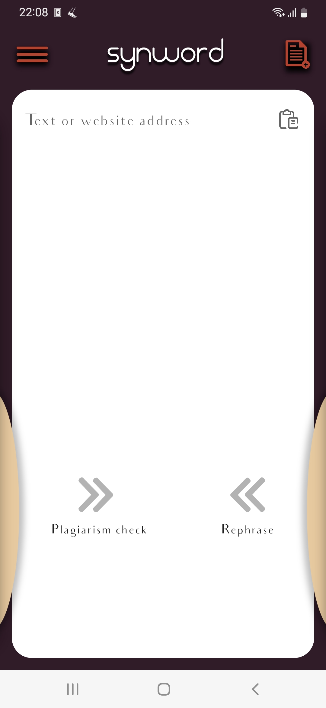
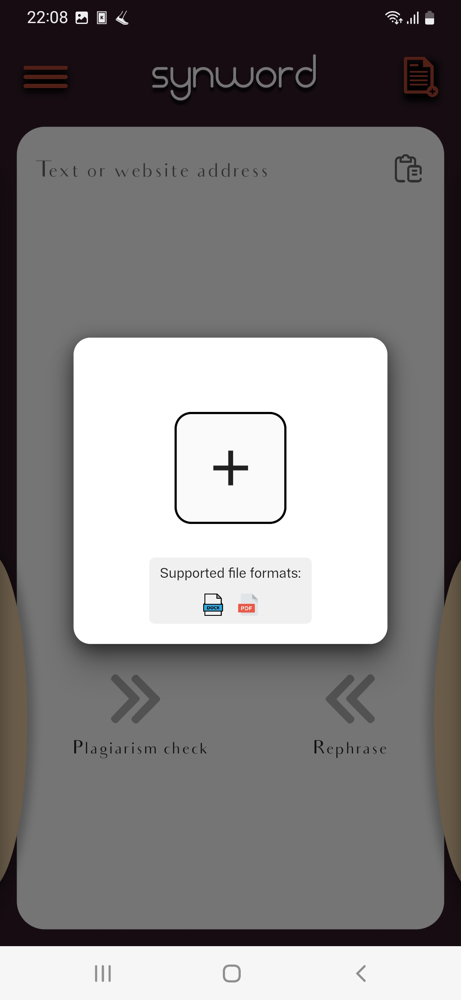
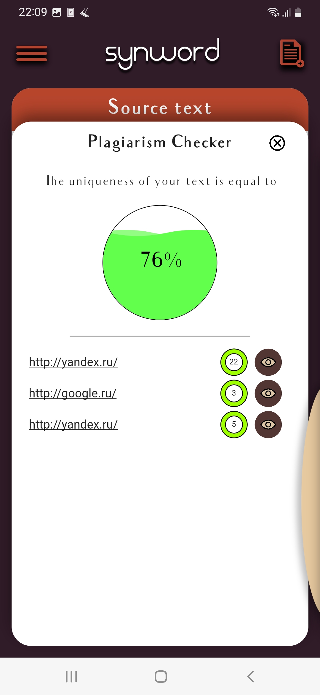
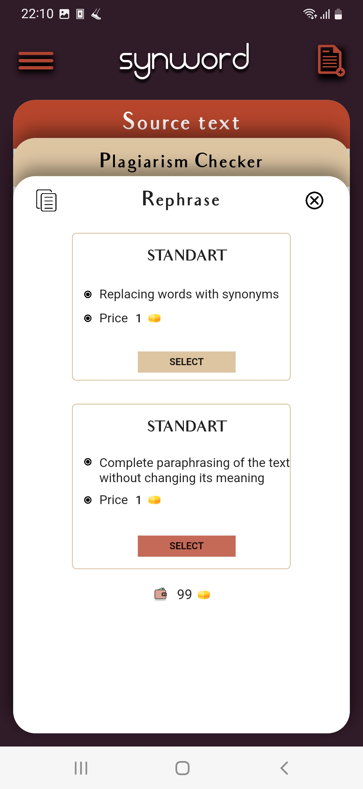
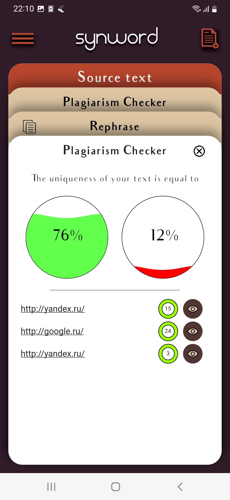
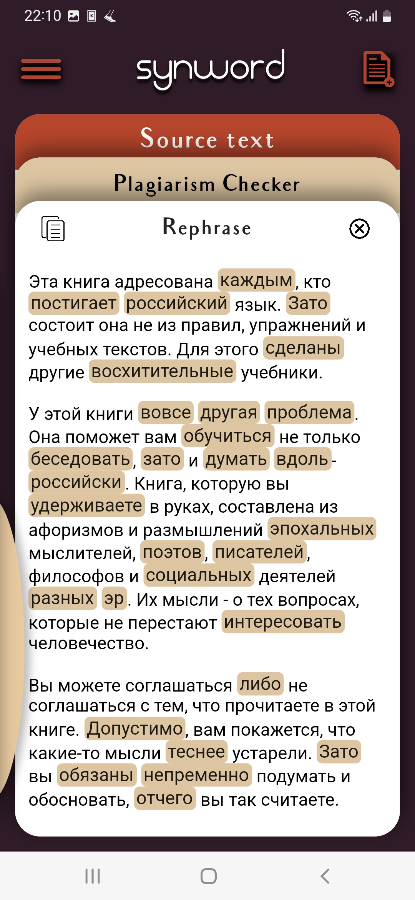
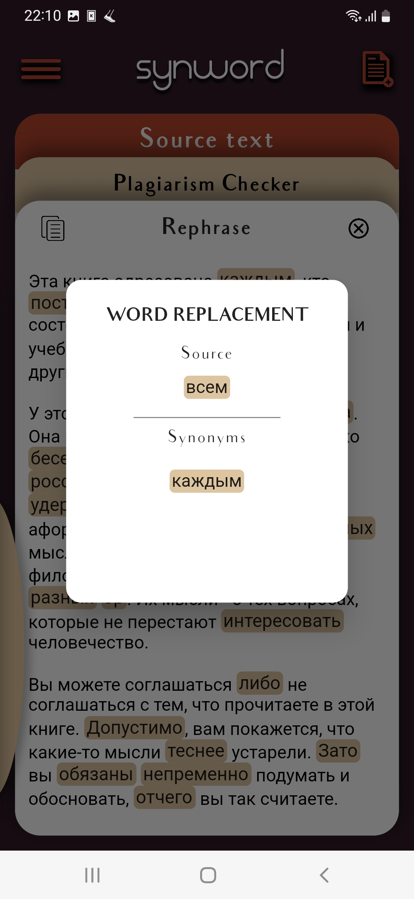
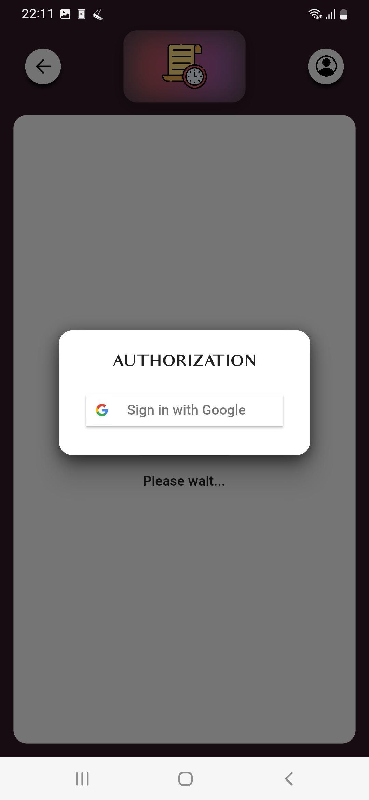

Synword

An application for checking and enhancing the uniqueness of the text.

**[Website](https://synword.com)**

- [Used packages](#used-packages)
- [Images](#images)

# Used packages

- cupertino_icons
- get_it
- bloc
- flutter_bloc
- hexcolor
- blur
- clipboard
- objectbox
- objectbox_flutter_libs
- dio
- jwt_decode
- file_picker
- url_launcher
- mapper_box
- google_sign_in
- flutter_signin_button
- package_info_plus

# Images

Screenshots are made with test data.

  

  

  

  

  

  

  

  

